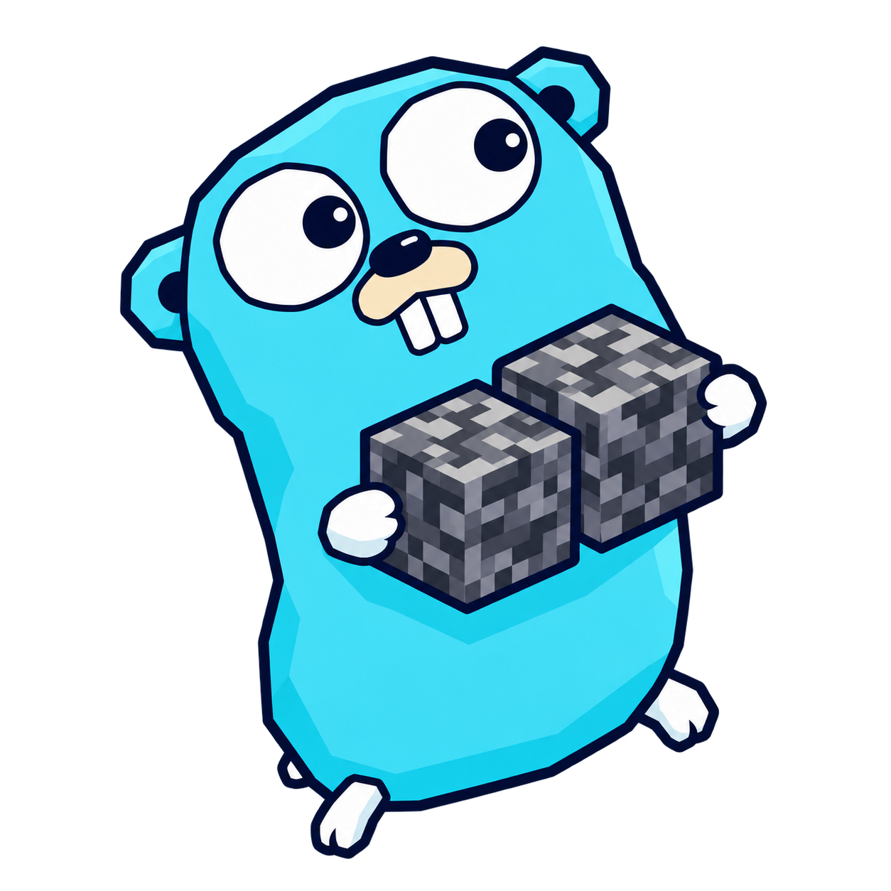

<p align="center">
  
</p>

<h1 align="center">go-multiversion</h1>

<p align="center">Minecraft Bedrock multiversion adapters for gophertunnel and Dragonfly.</p>

## Protocols

| Protocol ID | Minecraft version | Adapter | Support | Tested |
|------------:|-------------------|---------|:-------:|:------:|
| 2193 | 1.26.50 | Native gophertunnel | ✅ | ✅ |
| 2169 | 1.26.45 | `v1_26_45` | ✅ | ✅ |
| 2168 | 1.26.40-1.26.44 | `v1_26_44` | ✅ | ✅ |
| 1001 | 1.26.30-1.26.34, 1.26.36 | `v1_26_30` | ✅ | ✅ |
| 975 | 1.26.20, 1.26.21, 1.26.23 | `v1_26_20` | ✅ | ✅ |
| 944 | 1.26.10-1.26.14 | `v1_26_10` | ✅ | ✅ |
| 924 | 1.26.0-1.26.3 | `v1_26_0` | ✅ | ✅ |
| 898 | 1.21.130-1.21.132 | `v1_21_130` | ✅ | ✅ |
| 844 | 1.21.110-1.21.114 | `v1_21_110` | ✅ | ✅ |
| 827 | 1.21.100-1.21.102 | `v1_21_100` | ✅ | ✅ |
| 766 | 1.21.50-1.21.51 | `v1_21_50` | ✅ | ✅ |
| 748 | 1.21.40, 1.21.41, 1.21.43, 1.21.44 | `v1_21_40` | ✅ | ✅ |
| 486 | 1.18.10-1.18.12 | `v1_18_10` | ✅ | ✅ |
| 475 | 1.18.0-1.18.2 | `v1_18_0` | ✅ | ✅ |
| 419 | 1.16.100 | `v1_16_100` | ✅ | ✅ |

Unlisted releases and preview builds are not implied.

## Usage

Registry-aware adapters must be created after Dragonfly finalises its native
block registry:

```go
conf.AcceptedProtocolsProvider = func(blocks world.BlockRegistry) ([]minecraft.Protocol, error) {
	return multiversion.ProtocolsWithRegistries(blocks, dragonfly.VanillaItemEntries())
}
```

`ProtocolsWithRegistries` enables the registry-aware adapters. The parameterless
`Protocols()` intentionally omits adapters that need native block and item registries.

### Required integration

- Consumers need the matching [`shawtymarco/dragonfly`](https://github.com/shawtymarco/dragonfly)
  revision. Stock upstream Dragonfly does not provide the registry, protocol,
  or pre-hash palette hooks required by the historical adapters.
- Protocols `486`, `475`, and `419` also require the matching
  [`shawtymarco/gophertunnel`](https://github.com/shawtymarco/gophertunnel)
  revision for RakNet v10, Login-first negotiation, legacy flate batches, and
  protocol-specific encryption where required.
- Keep the consumer's immutable Dragonfly and gophertunnel fork revisions
  compatible with the native protocol pinned in [go.mod](go.mod).

## Credits

- [Sandertv/gophertunnel](https://github.com/Sandertv/gophertunnel)
- [df-mc/dragonfly](https://github.com/df-mc/dragonfly)
- [df-mc/worldupgrader](https://github.com/df-mc/worldupgrader)
- [Mojang/bedrock-protocol-docs](https://github.com/Mojang/bedrock-protocol-docs)
- [EndstoneMC/bedrock-server-data](https://github.com/EndstoneMC/bedrock-server-data)
- [TedacMC/tedac](https://github.com/TedacMC/tedac) for protocol-419 registry cross-checks
- Mascot adapted with OpenAI ImageGen from the [Go gopher](https://go.dev/blog/gopher) by Renee French, under [CC BY 4.0](https://creativecommons.org/licenses/by/4.0/).
